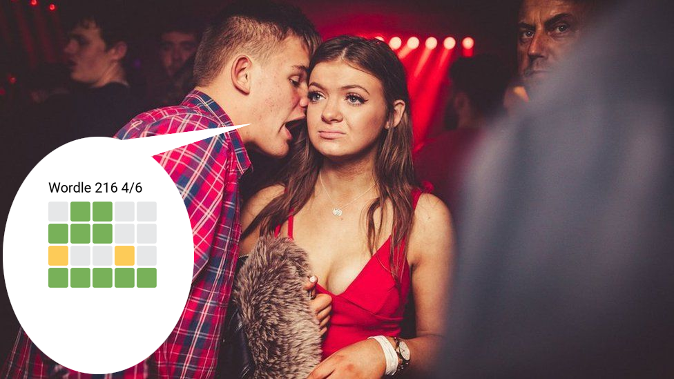

# What the hell is this?

This script has the sole purpose of combining [wordle](https://www.powerlanguage.co.uk/wordle/) results with the [Milk Edinburgh meme](https://knowyourmeme.com/memes/milk-edinburgh).

I made this for [@stormgrass](https://twitter.com/stormgrass) because he mentioned he wanted something like this in [this Tweet](https://twitter.com/stormgrass/status/1483820497246765058). 
Partly because I wanted to tinker around with this idea and party because I enjoy his [Podcast](https://www.geschichte.fm/) so much and wanted to make him happy with a little something.

# Installation
You need a working Python installation for this to work. Only the Pillow library is needed and can be installed via

    pip install -r requirements.txt
You can use any TrueType font you like. Either alter the script to your path or copy the corresponding .ttf-file into the main directory next to the script. I used Roboto-Regular which you can download from [here](https://fonts.google.com/specimen/Roboto).

# Usage

    python wordle.py "Wordle 216 4/6

    ⬜🟩🟩⬜⬜
    🟩🟩🟩⬜⬜
    🟨⬜⬜🟨⬜
    🟩🟩🟩🟩🟩"

If that doesn't work for you some reason you can also save the result in a file and pipe it like this:

    python wordle.py "$(cat result-example.txt)"
The output image is stored as wordle.png in this directory (and overwritten without confirmation so be careful!).

# Attribution
Twitter Emojis for the boxes are taken from [Twemoji](https://twemoji.twitter.com/).

[Robot Font](https://fonts.google.com/specimen/Roboto) which is under [Apache License, Version 2.0](http://www.apache.org/licenses/LICENSE-2.0)